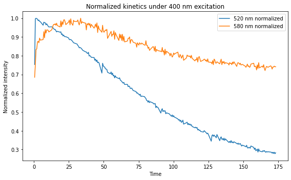
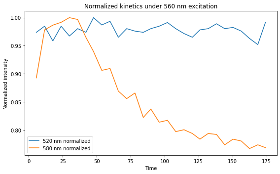

# Spectrofluorimeter Kinetics Analysis

## Overview

This project provides a Python pipeline for processing time-resolved spectrofluorimeter data and extracting fluorescence kinetics under alternating LED excitation.

The analysis focuses on fluorescence emission at:

* **520 nm (green channel)**
* **580 nm (red channel)**

under alternating excitation:

* **400 nm excitation**
* **560 nm excitation**

This repository contains two versions of the data processing script:

- `kinetics_raw.py`  
  The original script written during experimental work.  
  
- `kinetics.py`  
  A refactored version with improved structure, readability, and reusability.
  
---

## Experimental Setup

The experiment consists of alternating LED pulses with variable duration:

* 400 nm (blue excitation)
* 560 nm (green/yellow excitation)

### Data format

* First row: LED switching times
* Subsequent rows: spectral measurements over time

  * Column 1: time
  * Remaining columns: intensities across wavelengths

---

## Method

The processing pipeline:

1. Parses raw `.dat` spectrofluorimeter data
2. Extracts wavelength values
3. Identifies spectral regions:

   * 520 ± 0.5 nm
   * 580 ± 0.5 nm
4. Averages intensities within these ranges
5. Segments the time series based on LED switching
6. Outputs kinetics as CSV files

---

## Output

Generated files:

* `imp400_inten_520.csv`
* `imp400_inten_580.csv`
* `imp560_inten_520.csv`
* `imp560_inten_580.csv`

Each file contains:

```id="csvformat"
time, intensity
```

---

## Visualization

Kinetics were visualized using Jupyter Notebook.

## Example Results




### Key observations

* Under **400 nm excitation**, fluorescence at **520 nm** dominates
* Under **560 nm excitation**, fluorescence at **580 nm** becomes relatively stronger
* Signal intensity evolves smoothly over time, indicating dynamic transitions between states

---

## Interpretation

The observed fluorescence behavior is consistent with a **bichromatic fluorescent protein exhibiting multiple emissive states**.

* **400 nm excitation** preferentially enhances the green-emitting state (~520 nm)
* **560 nm excitation** increases the contribution of a red-shifted state (~580 nm)

This suggests the presence of at least two chromophore states and light-dependent transitions between them.

### Biological context

The observed spectral behavior is **consistent with reported properties of the photoconvertible protein, which exhibits:

* multiple emissive states
* wavelength-dependent excitation
* complex photoconversion dynamics

---

## How to Run

```bash id="runblock"
python kinetics.py m163A_conv.dat
```

---

## Requirements

* Python 3.x
* No external dependencies

---

## Project Structure

```
.
├── kinetics.py
├── kinetics_raw.py 
├── spectrofluorimeter_kinetics_visualization.ipynb
├── spectral_data.dat
├── imp400_inten_520.csv
├── imp400_inten_580.csv
├── imp560_inten_520.csv
├── imp560_inten_580.csv
└── README.md
```

---

## Motivation

This project demonstrates:

* Processing of raw experimental data
* Signal extraction from spectral measurements
* Time-series segmentation based on experimental protocol
* Scientific interpretation of fluorescence kinetics

---

## Author

Alexander Groshkov

